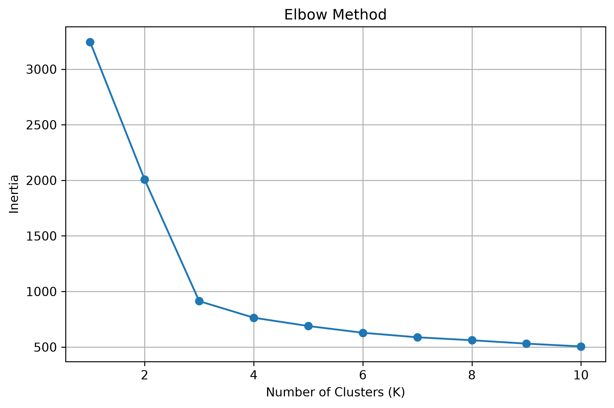
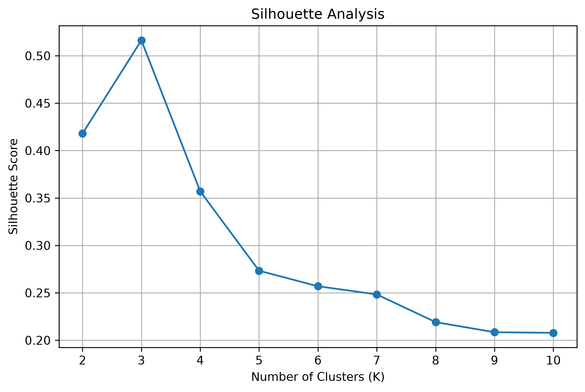
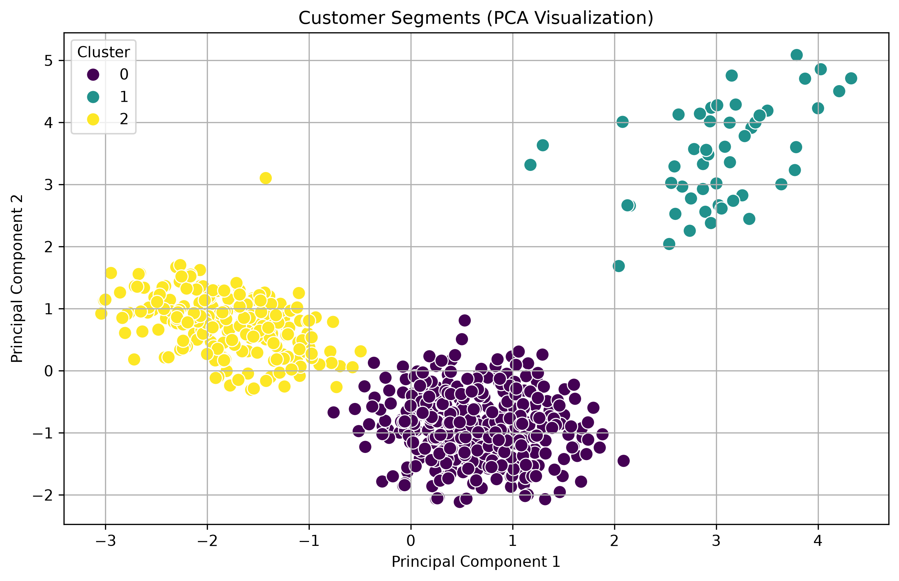

# 💳 Credit Card Customer Segmentation Predictor

A Machine Learning project that segments credit card customers into meaningful groups based on their banking behavior using **K-Means Clustering**.

The project performs complete data preprocessing, exploratory data analysis, clustering, visualization, business insight generation, model saving, and prediction for new customers.

---

# 🎯 Project Objective

The objective of this project is to segment credit card customers into groups with similar spending and banking behavior.

The discovered customer segments can be used for:

- Personalized marketing
- Customer targeting
- Premium service identification
- Banking recommendations
- Customer relationship management

---

# 📊 Dataset

**Source**

Kaggle

Dataset contains **661 customers**.

After removing the identifier columns (`Sl_No` and `Customer Key`), the model trains using the original customer features.

Features used:

- Avg_Credit_Limit
- Total_Credit_Cards
- Total_visits_bank
- Total_visits_online
- Total_calls_made

---

# 🛠 Technologies Used

- Python 3.14.5
- NumPy
- Pandas
- Matplotlib
- Seaborn
- Scikit-Learn
- Joblib
- Jupyter Notebook

---

# 📁 Project Structure

```text
credit-card-segmentation-predictor/

│
├── data/
│   └── credit_card_customer_data.csv
│
├── models/
│   ├── kmeans_model.joblib
│   ├── scaler.joblib
│   └── pca.joblib
│
├── notebooks/
│   └── Credit Card Customer Segmentation.ipynb
│
├── plots/
│   ├── elbow_method.png
│   ├── silhouette_analysis.png
│   └── pca_visualization.png
│
├── results/
│   ├── cluster_summary.csv
│   └── clustered_customers.csv
│
├── venv/
│
├── model.py
├── requirements.txt
└── README.md
```

---

# ⚙ Installation

Clone the repository

```bash
git clone <repository-url>
```

Move inside the project

```bash
cd credit-card-segmentation-predictor
```

---

## Create Virtual Environment

Windows

```bash
python -m venv venv
```

Activate

```bash
venv\Scripts\activate
```

Linux / macOS

```bash
python3 -m venv venv

source venv/bin/activate
```

---

## Install Dependencies

```bash
pip install -r requirements.txt
```

---

# 🚀 Running the Project

Run the notebook

```text
notebooks/
    Credit Card Customer Segmentation.ipynb
```

The notebook performs

- Exploratory Data Analysis
- Data Cleaning
- Feature Scaling
- Elbow Method
- Silhouette Analysis
- K-Means Clustering
- PCA Visualization
- Cluster Analysis
- Business Insights
- Model Saving

---

# 📈 Visualizations

## Elbow Method

Used to determine the optimal number of clusters.



---

## Silhouette Analysis

Measures cluster quality.



---

## PCA Visualization

Visual representation of the customer segments.



---

# 🧠 Customer Segments

The trained model identified **three customer groups**.

## 🟢 Cluster 1 — Premium Customers

- Highest average credit limit
- Highest spending capacity
- Ideal candidates for premium banking services
- Exclusive offers and loyalty programs

---

## 🔵 Cluster 0 — Medium Customers

- Moderate credit limit
- Regular banking behavior
- Opportunity for cross-selling
- Standard banking products

---

## 🟠 Cluster 2 — Low Priority Customers

- Lowest credit limit
- Basic banking services
- Higher customer support requirements
- Suitable for entry-level financial products

---

# 🤖 Prediction

The project includes **model.py**.

It will

- Load the saved Scaler
- Load the trained K-Means model
- Accept a new customer's information
- Scale the customer data
- Predict the customer's cluster
- Display the customer segment

Run

```bash
python model.py
```

---

# 💾 Saved Models

The notebook automatically saves

```
models/

kmeans_model.joblib

scaler.joblib

pca.joblib
```

These models are used by **model.py**.

---

# 📂 Generated Results

The notebook generates

```
results/

cluster_summary.csv

clustered_customers.csv
```

---

# 📊 Generated Plots

```
plots/

elbow_method.png

silhouette_analysis.png

pca_visualization.png
```

---

# 📚 Machine Learning Concepts Used

- Exploratory Data Analysis
- Feature Scaling
- StandardScaler
- K-Means Clustering
- Elbow Method
- Silhouette Score
- Principal Component Analysis (PCA)
- Customer Segmentation
- Business Insight Generation
- Model Serialization using Joblib

---

# 👨‍💻 Author

**Syed Abdul Hadi**

Aspiring Machine Learning Engineer

Goal:
Building practical Machine Learning projects and a strong AI portfolio.

---

# ⭐ If you found this project useful

Give the repository a ⭐ on GitHub.